# ComiCoin Glossary

## "Onboarding" Section

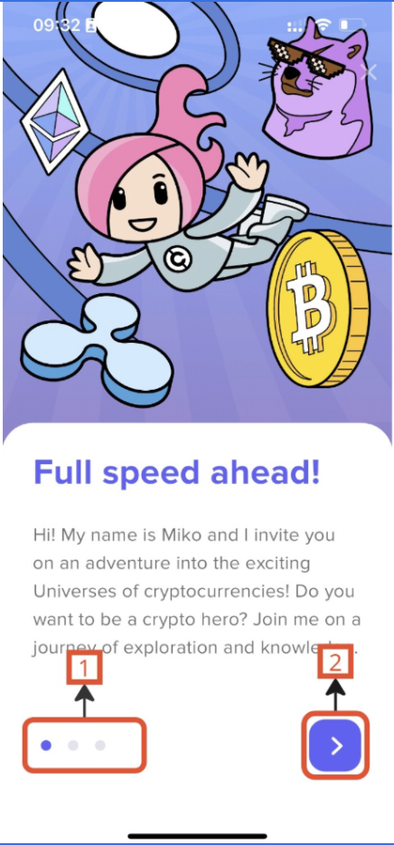
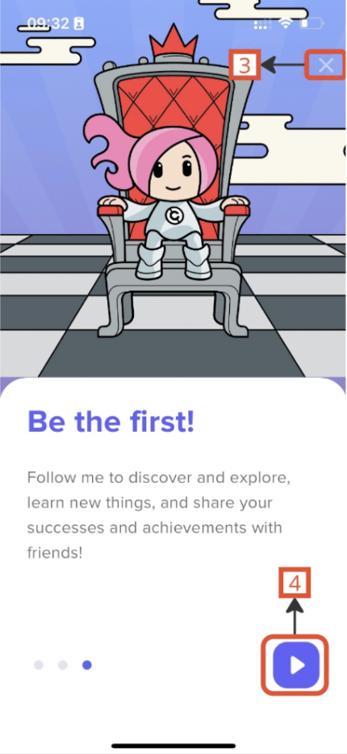

*Onboarding screens guiding users through the initial setup and app introduction.*

### Description of Elements:
- **1. Page Controls**: Indicators showing the current page in the onboarding flow.
- **2. Next Button**: Advances to the next page in the onboarding sequence.
- **3. Close Button**: Closes the onboarding process and takes the user to the main app.
- **4. Play Button**: Initiates the interactive onboarding or an animation.

## "Universes" Section

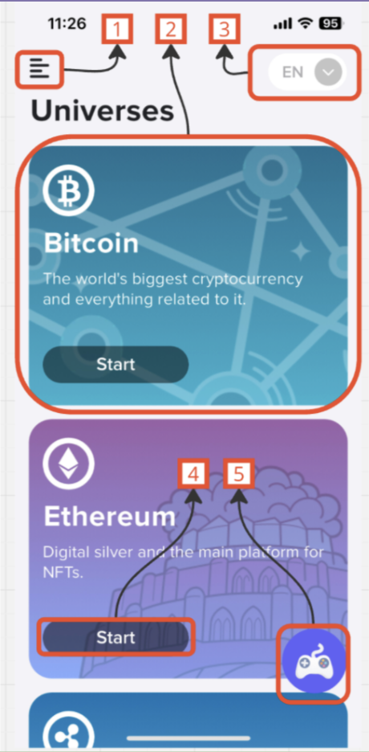
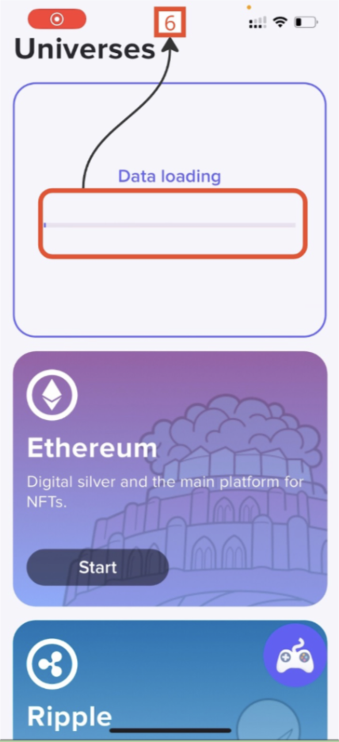
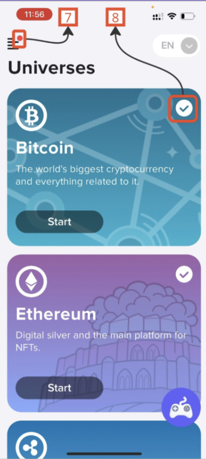

*Universes screen, showing different cryptocurrency universes and main actions.*

### Description of Elements:
- **1. Burger Menu**: Opens the main menu for navigation.
- **2. "{Name}" Tile**: Displays the name of the selected universe.
- **3. Language Dropdown Menu**: Allows selecting the preferred language.
- **4. [Start] Button**: Starts the selected action.
- **5. Floating Action Button (FAB)**: Special action button for additional options.
- **6. Loading bar**: Indicates data loading status.
- **7. Notification Indicator**: Alerts user to new notifications.
- **8. Completion Checkmark**: Marks completed items.

## "Language List" Screen

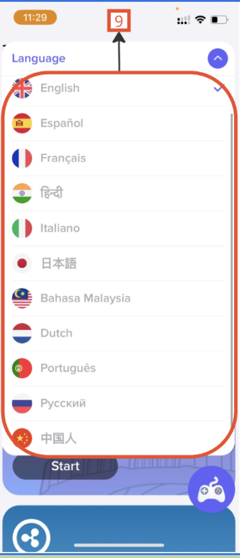
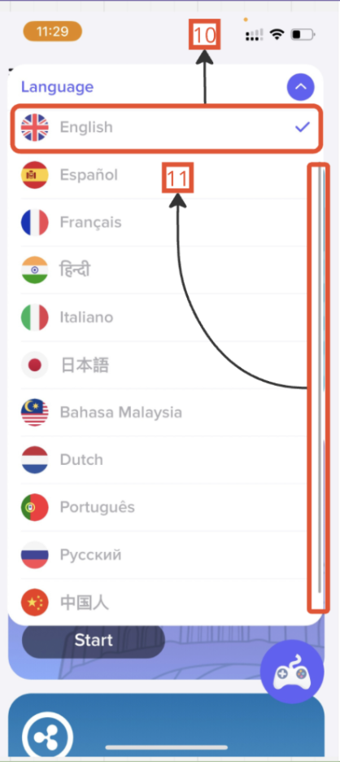

*Language list screen, where users can choose the app language.*

### Description of Elements:
- **9. Language List**: Shows available languages.
- **10. Current Language Checkmark**: Highlights the currently selected language.
- **11. Scroll Bar**: Allows scrolling through a long list of languages.

## "Universes" Section

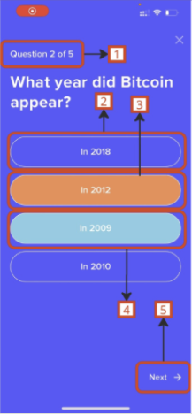
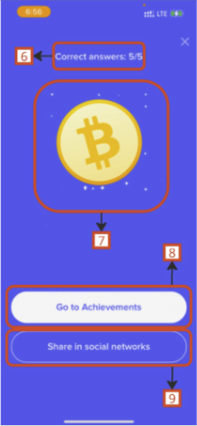
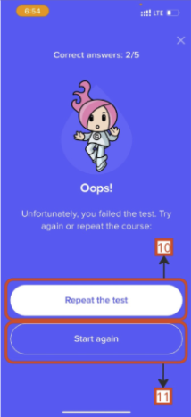
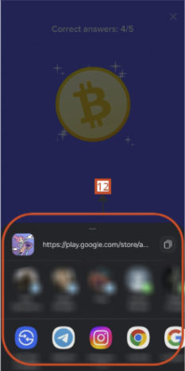
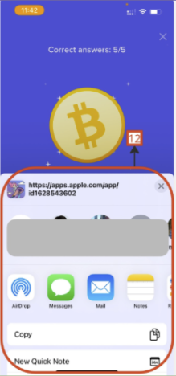

*Screens illustrating different states in the "Universes" section, including test screens and sharing options.*

### Description of Elements:
- **1. Question Counter**: Displays the current question number out of the total.
- **2. Unselected Answer**: An answer option that has not been selected.
- **3. Wrong Answer**: An answer option that is incorrect.
- **4. Correct Answer**: The correct answer to the question.
- **5. [Next] Button**: Moves to the next question in the test.
- **6. Answer Counter**: Shows the number of correct answers out of the total.
- **7. "{Name}" Icon**: Icon representing the user's character or status.
- **8. [Go to Achievements] Button**: Redirects the user to view achievements.
- **9. [Share in Social Networks] Button**: Allows the user to share results on social media.
- **10. [Repeat the Test] Button**: Restarts the test from the beginning.
- **11. [Start Again] Button**: Returns to the initial screen for a new attempt.
- **12. Share Menu**: System share menu allowing options for sharing results via different applications.

## "Main Menu" Section

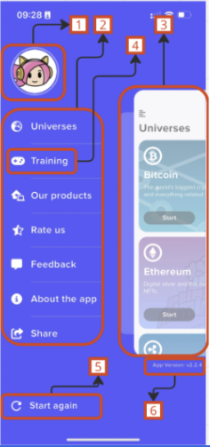

*Main Menu screen showing navigation options and user information.*

### Description of Elements:
- **1. Miko Icon**: Displays the user's avatar or profile icon.
- **2. Menu**: The main navigation menu with various options for app sections.
- **3. "{Name}" Block**: Highlights the current section or selected item.
- **4. "{Name}" Menu Item**: A menu item that directs to a specific app section.
- **5. [Start Again] Button**: Allows the user to restart the application flow from the beginning.
- **6. App Version**: Shows the current version of the application at the bottom of the menu.

## "Start Again" Modal Window

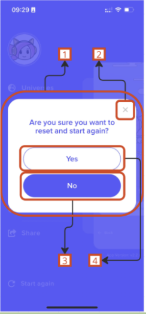

*Modal window asking for confirmation to reset and start again.*

### Description of Elements:
- **1. Modal Window**: The main confirmation window that appears over the main screen.
- **2. Close Button**: Closes the modal without performing any actions.
- **3. [No] Button**: Declines the reset action and closes the modal.
- **4. [Yes] Button**: Confirms the reset action and starts the process again from the beginning.
